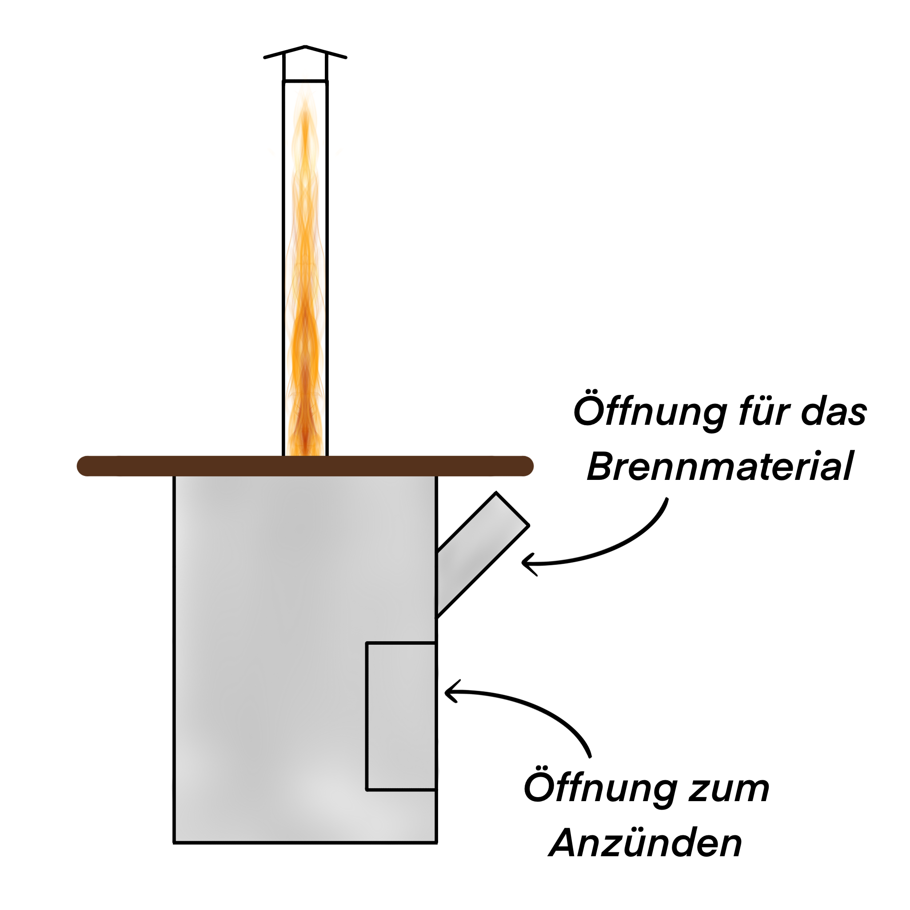

# IDPA 

This project is part of the IDPA project developed by my team and me. The main focus is on building a heated standing table. One of the key features of the table is a sensor that measures the fuel level (pellets). The data collected by the sensor will be displayed in a mobile app, which will also send a notification when it's time to refill the fuel.

The purpose of this repository is to host the code required for this functionality.

A non-scaled sketch of the table can be seen below.



## Further documentation

Further details and documentation can be found in the folder [doc](doc/).

Learn how to set the project up [here](#setup).

Learn how to run the mobile app [here](#running-the-mobile-app).

---

## Setup

### Before You Begin

1. Make sure you have a computer running Windows, Mac, or Linux
2. Have an internet connection

### For Windows Users

#### 1. Install Node.js

1. Open your web browser and go to: https://nodejs.org/
2. Click on "Install Node.js"
3. Download the "LTS" version "22.17.0" (click the green button)
4. Run the downloaded file and follow the installation steps
5. When asked, make sure to check "Add to PATH"

#### 2. Get the project files and install dependencies

1. Go to the project page on GitHub 
2. Click the green "Code" button 
3. Click "Download ZIP"
4. Unzip the file to a location you'll remember (like your Desktop)
5. Open the Start menu and search for "Command Prompt"
6. Open Command Prompt
7. Type:
    ```bash
   cd Desktop\[name of the unzipped folder]
   ```
   (Replace [name...] with your actual folder name)
8. Then type:
    ```bash
   npm install
   ```
9. Wait for the command to finish

#### 3. Create Environment variables

1. Open the project in your explorer
2. Add a new file named `.env` right in the Folder `IDPA`
3. Save your environment variables there - if you don't have them, simply copy the contents of the file `.env.example` in there
4. Save the file

### For Mac and Linux Users

#### 1. Install Node.js

1. Open your Terminal
2. Copy and paste this command, then press Enter:
   ```bash
   curl -o- https://raw.githubusercontent.com/nvm-sh/nvm/v0.39.7/install.sh | bash
    ```
3. Close and reopen your Terminal
4. Check if it worked by typing:
    ```bash
   nvm --version
   ```
   (If you see numbers, it worked!)

####  2. Get the Right Node Version

1. In Terminal, type:
    ```bash
   nvm install lts/jod
   ```
2. Then type:
    ```bash
   nvm use lts/jod
   ```

#### 3. Get the project files and install dependencies

1. Go to the project page on GitHub
2. Click the green "Code" button
3. Copy the web address (it starts with https://)
4. In Terminal, type:
    ```bash
   git clone [paste the address you copied]
   ```
5. Move into the project folder:
    ```bash
   cd [name of the folder you just created]
   ```
6. In Terminal, type:
   ```bash
   npm install
   ```
7. Wait for the command to finish

#### 4. Create Environment variables

1. Open the project in your explorer
2. Add a new file named `.env` right in the Folder `IDPA`
3. Save your environment variables there - if you don't have them, simply copy the contents of the file `.env.example` in there
4. Save the file

---

## Running the mobile app

If you haven't already, make sure to follow the instructions in [setup](#setup).

### Start the mobile app

1. Open your Terminal/Command Prompt
2. Change into the the folder of this project
3. Type:
    ```bash
   cd apps/mobile/
    ```
4. Then type:
    ```bash
   npm start
   ```

### View the mobile app

#### For iPhone

1. Install "Expo Go" from the App Store 
2. Open the app and scan the QR code with your camera

#### For Android

1. Scan the QR code that appears with your phone's camera

#### For Browser

1. Open `http://localhost:8081/` on your computer's browser

## Author

Anna-Lea Jakob
