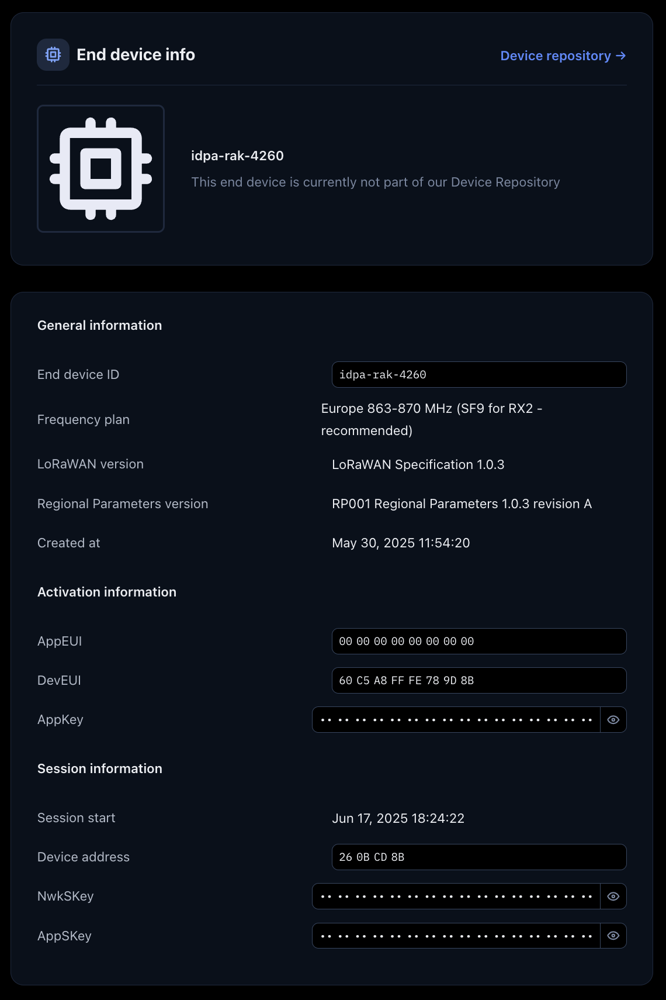
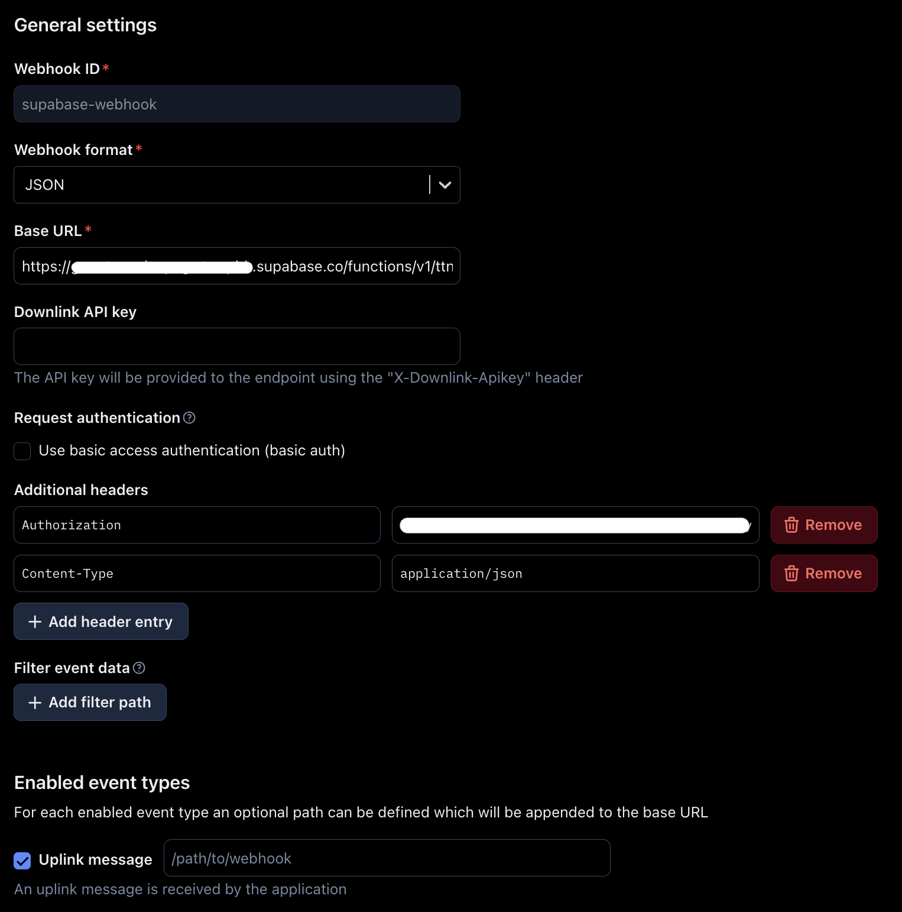
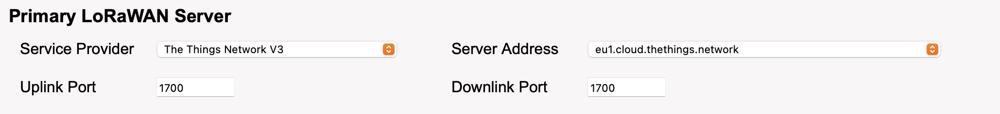

# LoRaWAN and TTN documentation

This is a documentation of my LoRaWAN and TTN (The Things Network) setup for this project.

**Contents:**

* [TTN setup for sending messages](#ttn-setup-for-sending-messages)
* [Send Data to TTN](#send-data-to-ttn)
* [Forward messages from TTN to a webhook](#forward-messages-from-ttn-to-a-webhook)
* [Host a TTN Gateway using a Dragino LPSN8](#host-a-ttn-gateway-using-a-dragino-lpsn8)

## TTN Setup for sending messages

### Host an application on TTN

1. Open your browser and go to: [https://www.thethingsnetwork.org](https://www.thethingsnetwork.org)
2. Log in or create an account, then open the TTN Console
3. In the left menu, click "Applications"
4. Click the blue "Add Application" button
5. Choose an Application ID and a name
6. Click on "Create Application"
7. You'll be forwarded to a dashboard.

### Add the device to the application

The device needs to be added to your application in the TTN console so that the messages that the device sends can be received, displayed and forwarded if necessary.

First of all make sure you have a device that can connect to TTN using LoRaWan, like [RAK3244 BastWAN Breakout Board](https://docs.rakwireless.com/product-categories/wisduo/bastwan/datasheet/).

1. Click on the "End devices" tab on the left navigation, then click the blue "Register end device" in the top right corner.
2. Follow the instructions and enter the configurations for your device.
3. Save your settings.

Your device is now able to connect to TTN.

The settings for my device can be viewed in the image below:

## Send Data to TTN

Sending data to TTN can work in various ways since there are various devices who can do so.

For the RAK3244 BastWAN Breakout Board however, there is a tutorial for Arduino with an example code that works. The tutorial can be found [here](https://docs.rakwireless.com/product-categories/wisduo/bastwan/quickstart/).

## Forward messages from TTN to a webhook

1. Open your browser and go to: [https://www.thethingsnetwork.org](https://www.thethingsnetwork.org)
2. Log in or create an account, then open the TTN Console
3. In the left navigation, click "Webhooks"
4. Click the blue "Add webhook" button in the top right corner
5. Choose your template or select "Custom webhook" (like I did)
6. Save your changes.

The settings I applied for my webhook can be viewed in the image below. These settings immediately forward any message my device sends to TTn to my Supabase backend.

## Host a TTN Gateway using a Dragino LPSN8

### Get the device to work

1. Power on the Dragino LPSN8
2. The device will create a local Wi-Fi network called `dragino-<id>` 
3. Connect your computer or phone to the Dragino Wi-Fi network

    * Password: `dragino+dragino`
4. Open your browser and navigate to: **[http://10.130.1.1/](http://10.130.1.1/)**
5. Log in with:

    * Username: `root`
    * Password: `dragino`

### Register the Gateway on TTN

1. On the Dragino interface (`http://10.130.1.1/`), go to "LoRaWAN" -> "LoRaWAN -- Semtech UDP"
2. Copy the Gateway EUI shown there
3. In a new browser tab, go to: [https://www.thethingsnetwork.org](https://www.thethingsnetwork.org)
4. Log in or create an account, then open the TTN Console
5. In the left menu, click "Gateways"
6. Click the blue "Register Gateway" button
7. Paste the copied Gateway EUI
8. Choose a Gateway ID and a name
9. Select the correct frequency plan (e.g., "Europe 863-870 MHz (SF9 for RX2 - recommended)" for Europe/Switzerland)
10. Configure any other required settings
11. Click "Register Gateway" at the bottom

### Final configuration on the Dragino 

1. Back in the Dragino interface (`http://10.130.1.1/`), confirm that the LoRaWAN IoT service is active (you should see a green check mark)
2. Go to "LoRaWAN -> LoRaWAN -- Semtech UDP" again
3. Verify that the server settings match the following example:

   
4. Navigate to "LoRa" -> "LoRa" and confirm the correct frequency plan (e.g., EU868) is selected

### Confirm Connection

1. Return to the TTN Console -> Gateways section
2. Your Dragino LPSN8 gateway should now appear as connected
3. From this point on, nearby LoRaWAN devices should automatically connect through it
