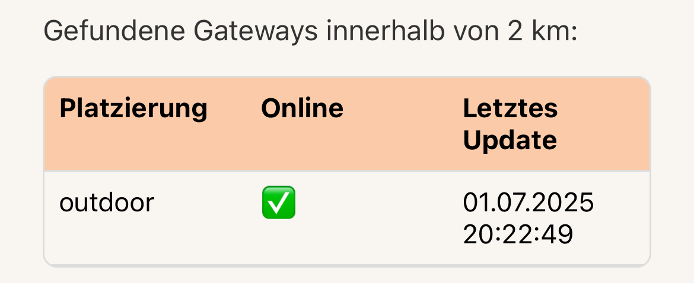

# Mobile App

This is a documentation of the functionality of the mobile app.

**Contents:**

* [Functionality of the app](#functionality-of-the-app)
* [Can I install / download the app](#can-i-download--install-the-app)

## Functionality of the app

### Overview

The app is in German (not translated to any other langauge) and has two different tabs:

1. The `Home` tab:

    

2. The `Settings` tab:

    

### Notifications

There are two different notifications one can get:

1. Battery is low:

   Every time the device sends its distance measurements to TTN, it also sends the status of the battery, which is either `LOW` or `OK`.
   
   If the battery status is `LOW` the app sends a notification:

   

2. Distance is more than 40cm:

   The "Füllrohr" (tube for the pellets) is 58cm long when it's empty. Obviously, the user wants to get a notification *before* all his pellets are burnt and there's only embers left.
   
   Considering some Inaccuracies in the measurement due to the uneven surface (the pellets), we decided to start sending notifications once the measurement is >= 40cm. 

   

### In-app tests on settings tab

1. Send test data_
   
   Using the button "Test Daten senden", you can send test data to the Supabase backend to see whether it is available and saves the data correctly:

   

2. Fetch all measurements:

   Using the button "Alle Messungen abrufen", you can fetch all entries that are currently saved in the Supabase database. Test data is highlightes in gray. 

   Test data is not displayed or used for calculations on the home tab.

   

3. Check TTN gateway coverage:

   Using the button "TTN-Gateway-Abdeckung prüfen", you can check if there's a TTN gateway within 2km of your phone's location (you need to allow the app to access your location).

      

4. Check the TTN gateway coverage for a specific place:

   Using the button "Standort manuell eingeben", you can switch to a textfield. Enter any location there. Then click on the button "TTN Gateway-Abdeckung prüfen". Any Gateways close to the location you entered will be listed.

   You can switch back to using your phone's location by clicking on the button "Standort dieses Handys verwenden".

   

## Can I download / install the app?

No, the app cannot be installed on your mobile phone. At least not properly. You can open the app through the app `ExpoGo` which you can download in your AppStore / Google Play Store.

Why, you may ask?

Despite wanting to make a release of the app it turned out to be more complicated and time-consuming than expected. This project had a time-limit of 80 hours and I wasn't going to invest all of them into coding. I had to write a documentation, that can't be viewed in this repository, and had to make tests as well. 

Furthermore we only finished soldering the electricity about a week before the project was due. Of course we, as the IDPA team, made a test run with the table, the electricity and the mobile app as soon as I was done with soldering. But at that point I had already invested a lot of time.

I tried to make a release, however it is not functional because I made a mistake in the build process.

I did want to retry, but I ran out of time. And that's why there is no release and hence no app to download and install.

---

Apart from some limitations with the notifications by opening the App through `ExpoGo`, the app is 100% functional with an implementation of notifications. 
