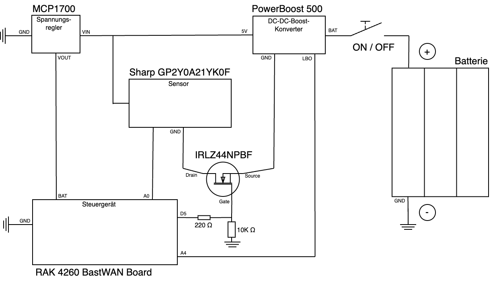

# Planning

**Contents:**

* [Collecting ideas](#collecting-ideas)
* [Source code structure](#source-code-structure)
* [Electricity](#electricity)

## Collecting ideas

Before starting this project, I took some time to plan ahead in order to avoid wasting time on refactoring the code later if something needed to be done differently.

I outlined my ideas in [this Google document](https://docs.google.com/document/d/1I1TKDZZO-J2w-6c60Onxl_0QAO_lC4riVjcmg8gWdN8/edit?usp=sharing).

Please note that the document is written in German and that not everything is explained in great detail. I kept things concise, as the document is intended to serve as a guideline rather than a full documentation of the final product.

## Source code structure

I've come to the decision to put the whole source code into one repository, as it's the least complicated.

This project is split into 3 parts:

1. [The Backend (Supabase)](supabase.md): `IDPA/apps/api`
2. [The Frontend (the mobile app)](mobile-app.md): `IDPA/apps/mobile`
3. [The Firmware (the code for the RAK 4260 BastWAN Board)](LoRaWan-and-ttn.md): `IDPA/apps/firmware`

Apart from that there's the documentation for this project in `IDPA/doc/`. I made sure to document the most important technical details, including information about the setup, the technical choices, tutorials, etc.

## Electricity

After talking to my informatics teacher and discussing my ideas with him, we planned how to solder all the components.

Once all components were delivered we started by putting them into an arduino board. We used it to test and refine our plan.

This is the circuit diagram of the final result with all components:

