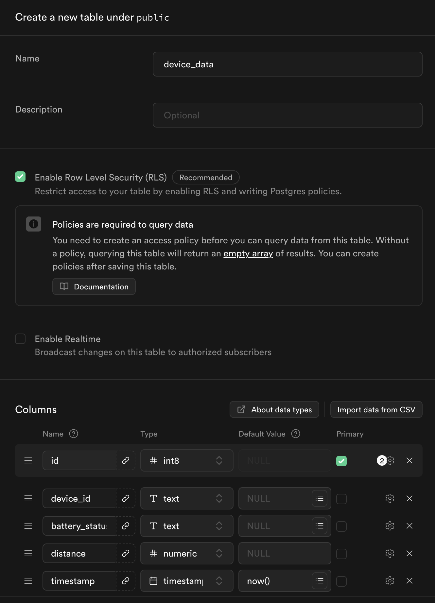

# Supabase documentation

This is a documentation of my Supabase setup for this project.

Note that I already have a Supabase account since I already used the platform for another project. 

**Contents:**

* [Create the project on Supabase](#create-the-project-on-supabase)
* [Create the necessary table](#create-the-necessary-table)
* [Grant access to Supabase table](#grant-access-to-supabase-table)
* [Create an edge function](#create-an-edge-function)
* [Create a database function](#create-a-database-function)

## Create the project on Supabase

Once you're logged in, you’ll be able to access your dashboard. For this project, I created a new organization by clicking the green "New Organization" button.

The settings I selected for the organization can be seen in the image below.


After creating the organisation, the project itself needs to be created. Luckily, you'll automatically be forwarded to the creation of the project after successfully creating the organisation.

The settings I selected for the project can be seen in the image below.


## Create the necessary table

On the left side in the Navigation select the tab "Table Editor". You'll find a green "Create a new table" button in the middle of your screen. Click on it to create a new table.

The settings I selected for the table can be seen in the image below. Note that the column for `id` has the extra options "Is Unique" and "Is Identity".



## Grant access to Supabase table

In the left-hand navigation panel, select the "Table Editor" tab to access your tables.

Next to the navigation panel, you'll see a list of all your tables. Hover over the table for which you want to edit the policies. Click on the three dots that appear, then select "View policies". This will display a list of all existing policies for that table.

To create a new policy, click the "Create policy" button on the left side. Then, apply the settings shown in the image below to grant read access from external sources—such as the React Native mobile app used in this project.


## Create an edge function

### Set up Supabase CLI

1. Install CLI:

    ```bash
   npm install -g supabase
   ```
   
2. Log in:

    ```bash
   supabase login
   ```
   
### Set up edge function

1. Change into the folder where you want your Supabase code to be.
2. Initialise:

    ```bash
   supabase init
   ```

3. Create a new edge function:

    ```bash
   supabase functions new function-name
   ```
    I chose `ttn-webhook` as the name for my edge function.
4. Link your local folder to your Supabase project

    ```bash
   supabase link --project-ref your_project_id
   ```

### Get your edge function to work

1. Edit `supabase/functions/ttn-webhook/index.ts` to your liking.
2. Deploy the edge function:

    ```bash
   supabase functions deploy function-name --project-ref your-project-id
   ```

3. Open your project on the Supabase website and select the tab "Edge Functions" in the navigation on the left side. Your edge function should be listed there now.

## Create a database function

1. Open your project on the Supabase website and select the tab "SQL Editor" in the navigation on the left side.
2. Write your database function.
3. Run the SQL script.
4. The function will automatically be added to your database.
5. You can select the tab "Database" in the navigation on the left side and then click on "Functions" to check if it worked.

If you want to implement your database script locally, you can add a new file inside `supabase/functions`. You should name it `function-name.sql`. I chose `delete_old_data` as the name for my database function.

Once you're done with your function, you can deploy it using the command below.

```bash
supabase db push
```
